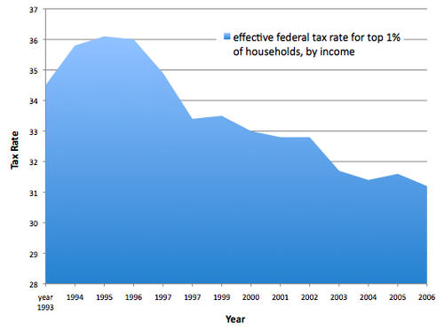
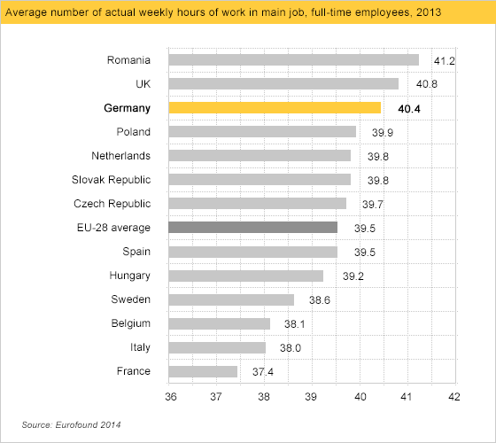
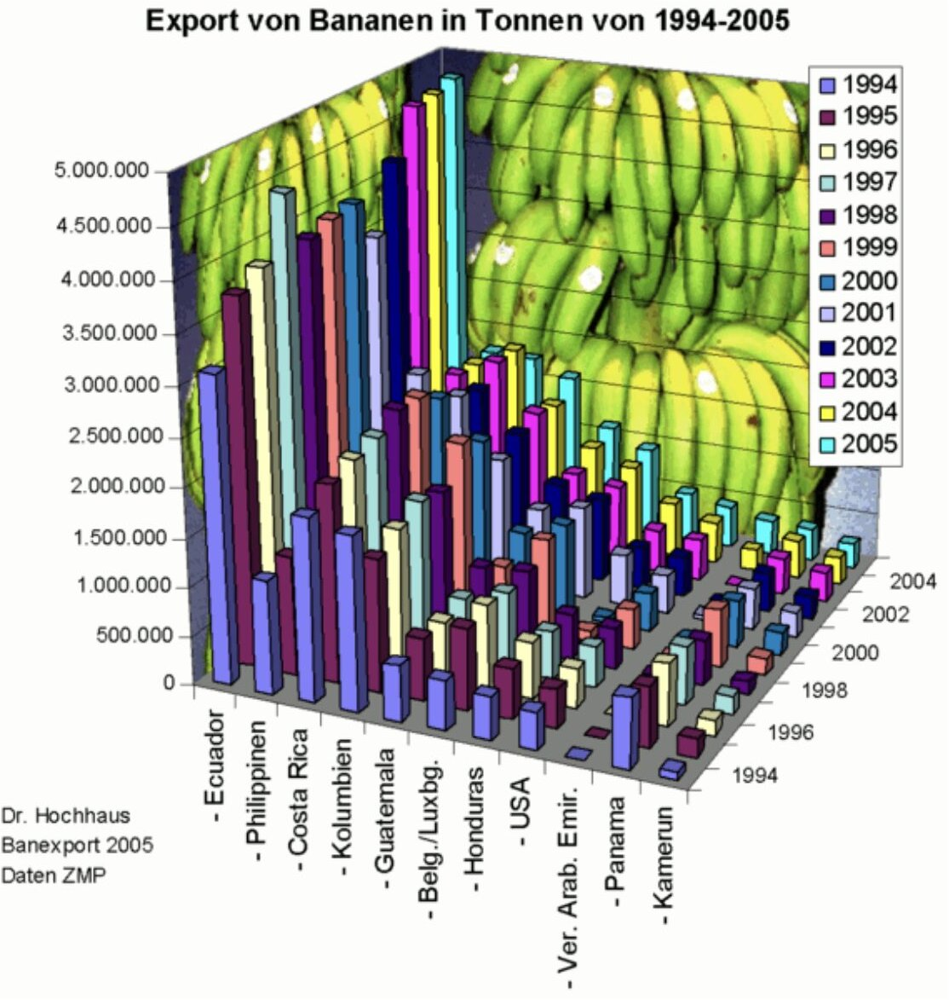
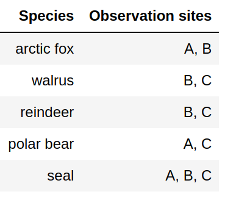
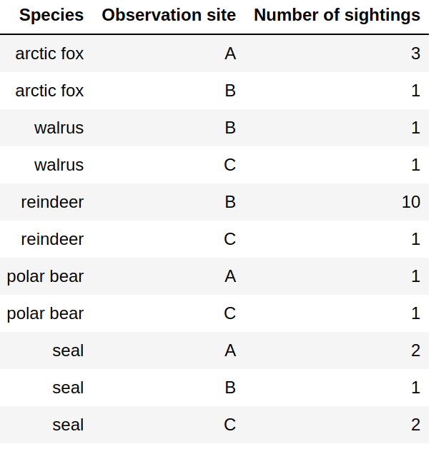

class: center, middle

# Data visualization

<br>

## Radovan Bast ([@__radovan](https://twitter.com/__radovan))
### UiT The Arctic University of Norway

<br>

### Slides: http://bit.ly/data-visualization-fsk-8002

---

# About me

.left-column30[

]

.right-column70[
- Theoretical chemist turned research software engineer.

- I write research software and teach programming to researchers and lead the
  [CodeRefinery project](https://coderefinery.org).

- I lead the [high-performance computing group](https://hpc.uit.no) and the
  [research software engineering group](https://research-software.uit.no) at UiT.
]

---

## CodeRefinery

We teach tools and practices for the
development of reproducible and reusable research software.

.left-column50[


- https://coderefinery.org
- https://coderefinery.org/workshops/past/
]
.right-column50[

]

---

## Goals for this course/lesson

### Our focus

- Data visualization for .emph[publications and presentations] within and outside academia

- .emph[Practical] recommendations

- .emph[Reproducibility] **for you** and others

- Know which tools exist -> .emph[good starting points]


### What I will not focus on

- Programming languages and technical details of tools

- Data visualization for the general public (newspapers, television)

---

## Overview

<!-- mention which sections will be there and how long each -->

.left-column50[
### Part 1

- Introduction

- Why visualizing data

- Figure design, design process, and fundamentals

- Gallery of visualizations

- Discussing problematic plots
]

.right-column50[
### Part 2

- Reproducibility and FAIR principles

- Data formats

- Figures and tables in reports and publications

- Choosing the right tools

- Reproducible and reusable plots


### Next week

- Data clinic
]

---

## Resources

### Books

- ["Fundamentals of Data Visualization", C. O. Wilke](https://clauswilke.com/dataviz/)
  > .remark[Excellent book which does not focus on R or Python but on the fundamentals]
- ["Data Visualization: A practical introduction", K. Healy](https://socviz.co/)
  > .remark[Good if you want to learn R at the same time]
- ["Data Visualisation: A Handbook for Data Driven Design", A. Kirk](https://www.visualisingdata.com/book/)
  > .remark[Great book but a bit too general for me]

> .remark[There are many more ...]

---

## More resources

### Papers

- [N. P. Rougier, M. Droettboom, P. E. Bourne, "Ten Simple Rules for Better Figures", PLoS Comput Biol 10(9): e1003833 (2014)](https://doi.org/10.1371/journal.pcbi.1003833)


### Lessons/talks

- https://swcarpentry.github.io/visualization-novice/
- https://www.ub.uio.no/english/courses-events/events/all-libraries/2020/research-bazaar/visualisation.html
- https://ajstewartlang.github.io/SIPS_2019/SIPS_presentation.html


### Twitter

- https://twitter.com/hashtag/TidyTuesday

---

.quote["One thing I have learned over the years is that automation is your
friend. I think figures should be autogenerated as part of the data analysis
pipeline (which should also be automated), and they should come out of the
pipeline ready to be sent to the printer, no manual post-processing needed."]

.cite[["Fundamentals of Data Visualization", C. O. Wilke](https://clauswilke.com/dataviz/)]

<br>


.cite[https://twitter.com/kara_woo/status/1134878080567091200]

---

## 2 take-home messages

### Avoid tools that cannot be automated/scripted

- It may cause you the last minute trouble.

- Stay away from tools where plots can only be modified manually by pointing
  and clicking.


### Optimize for comprehension and accessibility

- So that we don't have to study the plot for 20 minutes with eyes hurting to
  get the message.

- Font size, colors, suitable representation, good title, and caption.

---

class: center, middle, inverse

# Why visualizing data?

<!-- 5 min -->

---

## Anscombe's quartet

.left-column60[

]

.right-column40[
All four plots have the .emph[same] mean of x and y, sample variance of *x* and
*y*, correlation between *x* and *y*, linear regression line, and *R^2* coefficient.

.cite[https://en.wikipedia.org/wiki/Anscombe%27s_quartet]

.cite[https://seaborn.pydata.org/examples/anscombes_quartet.html]
]

---

## Same Stats, Different Graphs


.cite[[A. Cairo, "Datasaurus: Never trust summary statistics alone; always visualize your data"](http://www.thefunctionalart.com/2016/08/download-datasaurus-never-trust-summary.html)]

.cite[[J. Matejka, G. Fitzmaurice, "Same Stats, Different Graphs: Generating Datasets with Varied Appearance and Identical Statistics through Simulated Annealing"](https://www.autodeskresearch.com/publications/samestats)]

---

## Why visualizing data?


### More insight into data: easier to see patterns and problems

- Both calculations and graphs will contribute to understanding

.left-column50[
### Communicating insight

- Presentations/papers: facilitate understanding
- Communication with the public

> .remark[reflect on how important and powerful data visualization is, in particular in 2020-2021: COVID-19, politics, climate change, ...]
]

.right-column50[
### Because others do it or tell us to

- And we often copy the style and culture
]

---

class: center, middle, inverse

# Figure design, design process, and fundamentals

---

Data visualization is a

## "Visual representation and presentation of data to facilitate understanding"

.cite[["Fundamentals of Data Visualization", C. O. Wilke](https://clauswilke.com/dataviz/)]


### Data visualizations map .emph[data values] onto .emph[aesthetics/channels]

- position
- length
- shape
- size
- color
- line width
- line type

---

## How I design plots

- Sometimes: Sketch with pen and paper

- Browse directories/galleries for inspiration:
  [Matplotlib](https://matplotlib.org/gallery.html),
  [Seaborn](https://seaborn.pydata.org/examples/index.html),
  [Altair](https://altair-viz.github.io/gallery/index.html),
  [Plotly](https://plotly.com/python/),
  [Bokeh](https://demo.bokeh.org/),
  [ggplot](https://yhat.github.io/ggpy/),
  [PyNGL](https://www.pyngl.ucar.edu/Examples/gallery.shtml),
  [K3D](https://k3d-jupyter.org/showcase/),
  [ggplot2](https://ggplot2.tidyverse.org/),
  [Shiny](https://shiny.rstudio.com/),
  [Data-Driven Documents](https://d3js.org/), ...
- Take an example that is close to what I want

- Try to rerun it with original example data

- Try to replace example data with my own data

- Tweak and refine


### How is your process from start to report/thesis/publication?

---

.left-column50[


]

.right-column50[


]

---

## Design principles

### Good data visualization is ...

- .emph[trustworthy/reliable]
- .emph[accessible/usable]
- .emph[elegant/aesthetic]

.cite[["Data Visualisation: A Handbook for Data Driven Design", A. Kirk](https://www.visualisingdata.com/book/)]


### Examples

- Reliable: Proportional ink
- Usable: Avoid 3D plots (unless it's 3D object)
- Elegant: "Maximize the data/ink ratio, within reason"

.cite[["Fundamentals of Data Visualization", C. O. Wilke](https://clauswilke.com/dataviz/)]

---

## Reliable: The principle of "proportional ink"

Examples with disproportional data/ink ratio:




.cite[Both figures from https://www.callingbullshit.org/tools/tools_proportional_ink.html]

---

## Usable: Avoid 3D plots (unless it's 3D object)

... unless you are plotting something inherently 3D (molecular structures,
structure of an enzyme, a 3D relief of a terrain)


.cite[https://matplotlib.org/3.1.1/gallery/mplot3d/scatter3d.html]


---

## Coordinates: linear vs. log

### There are also polar coordinates and spherical coordinates and their projections (more about that later)

.left-column50[


- Linear axes are linear in addition
]

.right-column50[


- Log scales are linear in multiplication
- Log scales used when the dataset contains numbers of very different magnitudes
]

---

## Colors

### Great resources

- https://clauswilke.com/dataviz/color-pitfalls.html
- https://blog.datawrapper.de/beautifulcolors/
- [Okabe, M., and K. Ito. 2008. "Color Universal Design (CUD): How to Make Figures and Presentations That Are Friendly to Colorblind People."](https://jfly.uni-koeln.de/color/)
- https://seaborn.pydata.org/tutorial/color_palettes.html
- https://colorbrewer2.org/

---

## Colors

### Fundamental use cases

- Distinguish groups of data

- Represent data values

- Highlight

.cite[["Fundamentals of Data Visualization", C. O. Wilke](https://clauswilke.com/dataviz/)]


### This is how most of us start but this is problematic:

.quote["We need five colors for the plot: black ... red ... green ... blue ... ... ... orange?"]

---

## Colors

### Consider color vision deficiencies (CVD)

.left-column50[

]

.right-column50[
- 4% of the population is affected

- View your color figures under CVD simulations

- Use color scales designed to be CVD-friendly
]

---

## Color scales: 3 types

- .emph[Discrete/qualitative] color scales: designed to distinguish


.cite[[Okabe, M., and K. Ito. 2008. "Color Universal Design (CUD): How to Make Figures and Presentations That Are Friendly to Colorblind People."](https://jfly.uni-koeln.de/color/)]

- .emph[Sequential/continuous] color scales: represent data values


- .emph[Diverging] color scales: visualize deviation of data values relative to a neutral midpoint
.cite[ColorBrewer pink to yellow-green]


---

## Discrete/qualitative color scales: designed to distinguish

.left-column50[


- Great for scatter-plots.

- What if you need more than 8 colors? Use direct labeling instead.

.cite[[Okabe, M., and K. Ito. 2008](https://jfly.uni-koeln.de/color/)]
]

.right-column50[


.cite[<https://seaborn.pydata.org/examples/multiple_regression.html>]
]

---

## Sequential/continuous color scales: represent data values

.left-column50[


- Great for choropleth plots (here plotting unemployment rate).

- Color vision deficiencies less of a concern for this type.
]

.right-column50[


.cite[<https://altair-viz.github.io/gallery/choropleth.html>]
]

---

## Diverging color scales: visualize deviation of data values relative to a neutral midpoint

.left-column50[


- Great for heatmaps.

.cite[ColorBrewer pink to yellow-green]
]

.right-column50[


.cite[<https://seaborn.pydata.org/examples/many_pairwise_correlations.html>]
]

---

class: center, middle, inverse

# Gallery of visualizations

---

## Gallery of visualizations

We will show .emph[typical examples] and discuss .emph[main pitfalls] for each:
.left-column50[

- x-y relationships

- Amounts

- Distributions

- Proportions

- Geospatial data

- Trends and uncertainty

.cite[Categorization somehow following https://clauswilke.com/dataviz/directory-of-visualizations.html]
]

.right-column50[
## The goal of doing this

- So that we know what to search for
- Source of inspiration


## Where to find good overviews

These can offer other categorizations:

- https://clauswilke.com/dataviz/directory-of-visualizations.html
- https://datavizcatalogue.com/search.html
- https://depictdatastudio.com/charts/
- https://github.com/ft-interactive/chart-doctor/tree/master/visual-vocabulary
]

---

## x-y relationships (1/3)

.left-column50[
### Line graph


.cite[https://seaborn.pydata.org/examples/wide_data_lineplot.html]
]

.right-column50[
### Scatterplot


- Smooth lines can be used to represent trends

.cite[https://seaborn.pydata.org/examples/multiple_regression.html]
]

---

## x-y relationships (2/3)

.left-column50[
### Bubble plot


.cite[https://seaborn.pydata.org/examples/scatter_bubbles.html]
]

.right-column50[
### Pitfalls

- Overplotting -> bins or contours
- Too many colors -> different plot type or labels
]

---

## x-y relationships (3/3)

.left-column50[
### Bins


.cite[https://seaborn.pydata.org/examples/hexbin_marginals.html]
]

.right-column50[
### Contours


.cite[https://seaborn.pydata.org/examples/multiple_bivariate_kde.html]
]

---

## Amounts (1/3)

.left-column50[
### Bars


- Mind the principle of .emph[proportional ink]
- Bars need to start at zero
- Instead of bars one can use dots

.cite[https://altair-viz.github.io/gallery/simple_bar_chart.html]
]

.right-column50[
### Grouped bars


- Bars can be horizontal or vertical
- We can split them by facetting

.cite[https://altair-viz.github.io/gallery/grouped_bar_chart.html]
]

---

## Amounts (2/3)

.left-column60[
### Stacked bars


.cite[https://altair-viz.github.io/gallery/horizontal_stacked_bar_chart.html]
]

.right-column40[

- Horizontal works well for longer labels
- Arrange bars in a logical/intuitive order
- Stacking is useful if the sum of amounts represents a meaningful amount
- Only the yellow portion is easy to compare
- Works very well if there are only two bars in each stack
]

---

## Amounts (3/3)

### Heatmap


.cite[https://altair-viz.github.io/gallery/simple_heatmap.html]

---

## Distributions (1/4)

.left-column50[
### (Faceted) histogram


- Always explore multiple bin widths

.cite[https://seaborn.pydata.org/examples/faceted_histogram.html]
]


.right-column50[
### Layered histogram


.cite[https://altair-viz.github.io/gallery/layered_histogram.html]
]

---

## Distributions (2/4)

.left-column50[
### Stacked histogram


- Difficult to interpret
- Both histograms and density plots require arbitrary parameters choices
]

.right-column50[
### Density plot


- Works better than histograms to visualize several distributions at once
- Check scaling and boundary conditions for density estimates
]

---

## Distributions (3/4)

### Ridgeline plot


.cite[https://altair-viz.github.io/gallery/ridgeline_plot.html]

---

## Distributions (4/4)

### Strip-plot vs box-plot vs violin-plot


.cite[[J. Matejka, G. Fitzmaurice, "Same Stats, Different Graphs: Generating Datasets with Varied Appearance and Identical Statistics through Simulated Annealing"](https://www.autodeskresearch.com/publications/samestats)]

---

## Proportions (1/2)

.left-column50[
### Pie chart


- Space inefficient

.cite[https://matplotlib.org/3.1.1/gallery/pie_and_polar_charts/pie_features.html]
]


.right-column50[
### Stacked bar chart


- Contributions easier to compare in side-by-side bars

.cite[https://altair-viz.github.io/gallery/normalized_stacked_bar_chart.html]
]

---

## Proportions (2/2)

.left-column50[
### Stacked areas/densities


.cite[https://altair-viz.github.io/gallery/normalized_stacked_area_chart.html]
]

.right-column50[
### Treemap


.cite[CC-BY-SA Ali Zifan https://en.wikipedia.org/wiki/Treemapping]
]

---

## Geospatial data (1/2): projections


- Projection from 3D onto 2D introduces distortion
- Projections can preserve either angles or areas but not both

.cite[https://altair-viz.github.io/gallery/world_projections.html]

---

## Geospatial data (2/2): Choropleth maps


- Work best when coloring represents a density
- Can be problematic when it represents a quantity which is not a density (example: Fig 15.14 in https://clauswilke.com/dataviz/geospatial-data.html)

.cite[https://altair-viz.github.io/gallery/choropleth.html]

---

## Trends and uncertainty (1/4)

.left-column50[
### Smoothing models


.cite[https://altair-viz.github.io/gallery/scatter_with_loess.html]
]

.right-column50[
- Averaging, polynomial fits, splines, LOESS (locally estimated scatterplot smoothing), ...

- Usually better to fit a line to transformed data than to fit a nonlinear
  curve to untransformed data
]

---

## Trends and uncertainty (2/4)

### Confidence bands


.cite[https://altair-viz.github.io/gallery/line_with_ci.html]

---

## Trends and uncertainty (3/4)

.left-column50[
### Boxplots


.cite[https://seaborn.pydata.org/examples/grouped_boxplot.html]
]

.right-column50[
### Error bars


.cite[https://seaborn.pydata.org/examples/pointplot_anova.html]
]

---

## Trends and uncertainty (4/4)

- Error bars can extend horizontally or vertically or both (2D error bars)
- Graded error bars and confidence strips are also used

.left-column50[
### There is no commonly accepted standard for error bars

- Always indicate what these mean: standard deviation? standard error of the
  mean? 95% confidence interval? 95% credible interval?
- Example: Fig 16.5 in https://clauswilke.com/dataviz/visualizing-uncertainty.html
]

.right-column50[
### We remember this problem


- Box plots invented when figures were still drawn by hand

.cite[[J. Matejka, G. Fitzmaurice, "Same Stats, Different Graphs: Generating Datasets with Varied Appearance and Identical Statistics through Simulated Annealing"](https://www.autodeskresearch.com/publications/samestats)]
]

---

class: center, middle, inverse

# Problematic plots

---

## Example 1


.cite[Figure from https://twitter.com/GraphCrimes]

---

## Example 2



.cite[Figure from https://www.callingbullshit.org/tools/tools_proportional_ink.html]

---

## Example 3


.cite[Figure from https://twitter.com/GraphCrimes]

---

## Example 4


.cite[Figure from https://twitter.com/GraphCrimes]

---

## Example 5


.cite[Figure from https://www.callingbullshit.org/tools/tools_proportional_ink.html]

---

## Example 6


.cite[Figure from https://www.callingbullshit.org/tools/tools_proportional_ink.html]

---

## Example 7


.cite[Figure from https://twitter.com/GraphCrimes]

---

## Example 8

.left-column50[

]

.right-column50[
.cite[Figure from https://twitter.com/GraphCrimes]
]

---

## Example 9


.cite[Figure from https://twitter.com/GraphCrimes]

---

## Example 10


.cite[Figure from https://twitter.com/GraphCrimes]

---

## Example 11


.cite[Figure from https://twitter.com/GraphCrimes]

---

## Example 12


.cite[Example taken from ["Fundamentals of Data Visualization", C. O. Wilke](https://clauswilke.com/dataviz/)]

---

## Example 13


.cite[Example taken from ["Fundamentals of Data Visualization", C. O. Wilke](https://clauswilke.com/dataviz/)]

---

## Example 14


.cite[Example taken from ["Fundamentals of Data Visualization", C. O. Wilke](https://clauswilke.com/dataviz/)]

---

class: center, middle, inverse

# Reproducibility and FAIR principles

---

## Reproducibility and FAIR principles


.cite[(c) [Scriberia](http://www.scriberia.co.uk) for [The Turing Way](https://the-turing-way.netlify.com), CC-BY]

---


.cite[Heidi Seibold, CC-BY 4.0, https://twitter.com/HeidiBaya/status/1579385587865649153]

---

## FAIR principles and data visualization: Which problems can you anticipate?


### Findable

.quote["On which of my external hard-drives is my script?"]


### Accessible

.quote["Can you please give me access to your plotting scripts?"]


### Interoperable

.quote["How can I convert this file format?"]


### Reusable

.quote["I wish I could reuse this visualization pipeline for my new data!"]

---

class: center, middle, inverse

# Data formats

---

## What problems can arive when storing data like this?


<!-- this is a phantasy dataset, apologies to biology students/researchers - this is not my domain -->

Discuss possible problems in a collaborative document.

---

## What problems can arive when storing data like this?


- .emph[Format]: Limited interoperability with other programs
- .emph[Error prone] (see e.g. [this famous example](https://www.washingtonpost.com/news/wonk/wp/2013/04/16/is-the-best-evidence-for-austerity-based-on-an-excel-spreadsheet-error/))
- Difficult to parse ("understand") by scripts: .emph[difficult to automate]
- Not in *tidy format* (more about this later): .emph[difficult to extend/modify]

---

## How should we arrange the data?

.left-column50[



]

--

.right-column50[
For the moment let us not focus on the tool, but the .emph[data structure]

How can these 3 examples be problematic for .emph[automated data visualization]?

- In the compact structure we need to divide at the comma
- If we add more species or more observation sites, we need to adapt the visualization pipeline
]

---

## "Tidy data"

.left-column50[

]

.right-column50[
- Columns are variables

- Rows are observations/measurements

- "Long form"

- Order does not matter

- .emph[Easy to extend] with more species and more sites
  without modifying the scripts

- .emph[Structure for storing data] - this does not mean that this is ideal
  for tables in presentations or publications

.cite[[H. Wickham, "Tidy Data"](http://vita.had.co.nz/papers/tidy-data.pdf)]
]

---

## Standard data formats

.left-column50[
### Comma-saparated values (CSV)

```csv
Species,Observation site,Number of sightings
arctic fox,A,3
arctic fox,B,1
walrus,B,1
walrus,C,1
reindeer,B,10
reindeer,C,1
polar bear,A,1
polar bear,C,1
seal,A,2
seal,B,1
seal,C,2
```

- CSV is often a good choice
- Most visualization tools can read CSV data
]

.right-column50[
### There are many more formats

- [JSON](https://en.wikipedia.org/wiki/JSON)
- [XML](https://en.wikipedia.org/wiki/XML)
- [GeoJSON](https://geojson.org/)
- [NPY (NumPy arrays)](https://numpy.org/doc/stable/reference/generated/numpy.lib.format.html)
- [HDF5](https://en.wikipedia.org/wiki/Hierarchical_Data_Format)
- [SQL](https://en.wikipedia.org/wiki/SQL)
- Many domain-specific formats (such as [NetCDF](https://www.unidata.ucar.edu/software/netcdf/))
- .emph[Use standard formats, don't invent your own]
]

---

## Data cleaning

- Often we want to visualize data sets with inconsistent or missing entries:

```text
Date,Organization,Number of participants
2020-09-27,UiT,20
Oct 10 2020,UiT Norges arktiske universitet,15
"Nov. 11, 2020",UiT The Arctic University of Norway,40
2020-12-12,UiT The Arctic University of Norway,-
```

Data cleaning is a bit outside the scope of this course but still good to know:
- There are tools to clean and merge inconsistent data sets (e.g. [OpenRefine](https://openrefine.org/), see also
  [this Data Carpentry lesson](https://datacarpentry.org/OpenRefine-ecology-lesson/))
- This does not have to be done manually

---

## Folder organization

.left-column50[
This is only a suggestion:
```
my-project/
├── README.md
├── data/
│   ├── README.md
│   ├── LICENSE
│   ├── my-data.csv
│   └── another-data.csv
├── manuscript/
│   └── paper.tex
└── figures/
    ├── LICENSE
    ├── my-notebook.ipynb
    └── another-notebook.Rmd
```
]

.right-column50[
- There is not the one right way

- Organize them to be understandable and reproducible
  by others and your .emph[future you]

- .emph[Lottery factor]: If you win the lottery and leave academic research today,
  make sure your research group can still find all related files and understand them

- Add .emph[license files]: make data and script reusable by others
]

---

## Where to store it

- Store visualization script/notebook and data in a repository under .emph[version control]
  (e.g. on [GitHub](https://github.com/))
- Try to .emph[stora data close to the visualization pipeline] (same repository, even if it requires extra storage)
- Archive with a persistent identifier: get a .emph[digital object identifier (DOI)] on services like
  [Zenodo](https://zenodo.org/) or [Dataverse](https://dataverse.no/)


### How about too big data?

- Reference the DOI of the data
- Consider providing a smaller example data set needed to reproduce plots


### How about sensitive data?

- There are storage options for sensitive data (e.g. patient data) but this is outside the scope
- Consider providing a "mock" example data set

---

class: center, middle, inverse

# Figures and tables in reports and publications

---

## Tables in publications


- Each table has a .emph[number] and a .emph[caption] that can be cross-referenced
- It is customary to place the caption .emph[above the table]
- "Tidy data" is for storing/sharing data, not for publication tables
- Do not use vertical lines
- Do not use horizontal lines between data rows
- Text: left-aligned, numbers: right-aligned, single characters: centered
- Header fields: aligned with their data

---

## Figure titles and captions


- Each figure has a .emph[number] and a .emph[caption] that can be cross-referenced
- Title is the first element of the caption
- Axes and legends need titles as well

---

## Preparing figures for print

.left-column50[


- In .emph[presentation slides] you have the full screen
]

.right-column50[


- In .emph[publications] you have often only one column
- Increase font size and ticks
- Print the figure using the approximate size it will appear in - is it still readable?
]

---

## Copyright considerations

### The problem

- When you publish a manuscript, the copyright (including figures) is typically
  transferred to the publisher.

- Then if you want to use the figures that you created later, in principle you
  need to ask the publisher.


### This is how you can keep the copyright of your figures

- Upload them to [figshare](https://figshare.com/) or [Zenodo](https://zenodo.org/) or [Dataverse](https://dataverse.no/).

- License them under a [Creative Commons](https://creativecommons.org/) license.

- Use these figures in your manuscript.

- You can still use them outside (in your PhD thesis) since they are now licensed CC.

---

class: center, middle, inverse

# Choosing the right tools

---

## Choosing the right tools: scriptable

### There is not the one perfect language and not the one perfect library for everything

- You will have to choose what fits best you and your group
- We will show examples using .emph[Python, R, and JavaScript]

### No manual post-processing

- This will bite you when you need to regenerate
  50 figures one day before submission deadline or regenerate a set of figures
  after the person who created them left the group.
- Use software that can be scripted: batch processing and reproducibility (more about that in next section).

---

## Choosing the right tools: free

### Use free software and free tools

- Even if the university pays for a license, what happens after you leave university
  or after they stop paying? How can other groups build on your work?

- .emph[Python and R are free], and popular for "notebook"-based pipelines, but also a number
  .emph[JavaScript frameworks] exist, especially for maps.

- Plain text files for small datasets

- Standard formats instead of proprietary formats.

### For any academic discipline it will be a good investment to learn a bit of Python or R if you want to do data visualization

---

## Visualization libraries (incomplete list)

Two main families of libraries: procedural (e.g. Matplotlib) and declarative
(using grammar of graphics).

.left-column50[
### Python

- [Matplotlib](https://matplotlib.org/gallery.html): MATLAB users will be at home
- [Seaborn](https://seaborn.pydata.org/examples/index.html): statistical functions built in
- [Altair](https://altair-viz.github.io/gallery/index.html): declarative visualization (R users
  will be more at home), statistics built in
- [Plotly](https://plotly.com/python/): interactive graphs
- [Bokeh](https://demo.bokeh.org/): also here good for interactivity
- [ggplot](https://yhat.github.io/ggpy/): R users will be more at home
- [PyNGL](https://www.pyngl.ucar.edu/Examples/gallery.shtml): used in the weather forecast community
- [K3D](https://k3d-jupyter.org/showcase/): Jupyter notebook extension for 3D visualization
]

.right-column50[
### R

- [ggplot2](https://ggplot2.tidyverse.org/): system for declaratively creating graphics, based on the grammar of graphics
- [Shiny](https://shiny.rstudio.com/): interactive graphs and notebooks


### JavaScript

- [Data-Driven Documents](https://d3js.org/)
]

---

## Where to learn more

- https://carpentries.org/
  - https://datacarpentry.org/R-ecology-lesson/
  - https://datacarpentry.org/python-ecology-lesson/

- ["Data Visualization: A practical introduction", K. Healy](https://socviz.co/)

- https://coderefinery.github.io/data-visualization-python/

- https://coderefinery.github.io/jupyter/

---

class: center, middle, inverse

# Reproducible and reusable plots

---

## Jupyter notebooks

.left-column50[


- **One of the first notebooks: Galileo's drawings of Jupiter and its Medicean
    Stars** from Sidereus Nuncius. Image courtesy of the History of Science
    Collections, University of Oklahoma Libraries (CC-BY).
]

.right-column50[
- **Code, text, equations, figures, plots**, etc. are interleaved, creating a *computational narrative*.
- [*"an environment in which users execute code, see what happens, modify and
  repeat in a kind of iterative conversation between researcher and
  data"*](https://www.nature.com/articles/d41586-018-07196-1)
- The name "Jupyter" derives from Julia+Python+R, but today Jupyter kernels
  exist for [dozens of programming languages](https://github.com/jupyter/jupyter/wiki/Jupyter-kernels).
]

---

## Example

.left-column50[


Discovery of gravitational waves.
]

.right-column50[
As a case example, let us have a look at the analysis published together with the
discovery of gravitational waves. [This
page](https://losc.ligo.org/tutorials/) lists the available analyses
and presents several options to browse them.

- A quick look at short segments of data can be found at
  [https://github.com/losc-tutorial/quickview](https://github.com/losc-tutorial/quickview)
- The notebook can be opened and interactively explored
  using Binder by clicking the "launch Binder" button.
]

---

## Another example

.left-column50[


Stanford Activity Inequality Study.
]

.right-column50[
Researchers in the Stanford Activity Inequality Study measured daily
activity from cell phone tracking data for over 700,000 users in
different countries across the world.
- All data and notebooks are available at
  [https://github.com/timalthoff/activityinequality](https://github.com/timalthoff/activityinequality)

For **more examples**, head over to the [Gallery of interesting Jupyter
Notebooks](https://github.com/jupyter/jupyter/wiki).
]

---

## R Markdown

Same idea as in the Jupyter notebook.

Example:
- https://github.com/clauswilke/dataviz (the source code for https://clauswilke.com/dataviz/)
- Compare these two:
  - https://github.com/clauswilke/dataviz/blob/master/proportional_ink.Rmd
  - https://clauswilke.com/dataviz/proportional-ink.html

---


.cite[Juliette Taka, Logilab and the OpenDreamKit project (2017), https://opendreamkit.org/2017/11/02/use-case-publishing-reproducible-notebooks/]

---

## .emph[Demo]: visualization pipeline on [Binder](https://mybinder.org/)

- Python/[Altair](https://altair-viz.github.io/) on [Jupyter](https://jupyter.org/) served via [Binder](https://mybinder.org/):
  https://github.com/bast/jupyter-binder-example

- R/[ggplot2](https://ggplot2.tidyverse.org/) on [RStudio](https://rstudio.com/)/[R Markdown](https://rmarkdown.rstudio.com/) served via [Binder](https://mybinder.org/):
  https://github.com/bast/rstudio-binder-example

- All plots in this slidedeck are reproducible on Jupyter notebooks: https://github.com/bast/data-visualization


### Other fantastic tools which I will not demonstrate

- [Data-Driven Documents](https://d3js.org/) with [gallery of examples](https://observablehq.com/@d3/gallery)

- Interactive plots with [Shiny](https://shiny.rstudio.com/gallery/)

---

## [Zenodo](https://zenodo.org/) can give you a persistent identifier (DOI) and make your pipeline citable

Rather than specifying a GitHub repository when launching binder, you can instead use a Zenodo DOI.

Example:
- We will be using an existing Zenodo DOI [10.5281/zenodo.3886864](https://doi.org/10.5281/zenodo.3247652) to start Binder
- Go to https://mybinder.org and fill information using Zenodo DOI (as shown on the animation below):
  
- You can also get a Binder badge and update the README file in the
  repository. It is good practice to add both the Zenodo badge and the
  corresponding Binder badge.

---

## Progression

- Start with a working example and try adapting it
- Learn the very basics
  - Learn a bit of Python
  - Or R
- It can be a good idea to start learning right away in a notebook
  - Python: Jupyter
  - R: R Markdown in R Studio
  - [Quarto](https://quarto.org/)
- Later try Binder
- Later learn how to get a DOI for your Binder
- Now your plotting recipe can be cited and is reproducible


### This takes time and it is OK to take time

.quote[If I had six hours to chop down a tree, I’d spend the first four hours sharpening the axe.]
.cite[Abraham Lincoln]

---

## Summary

- FAIR principles and reproducibility will be good for you (and for others)

- Document all tools and dependencies used .emph[with versions]

- Prefer .emph[free tools]

- Slides: http://bit.ly/data-visualization-fsk-8002

- Sources: https://github.com/bast/data-visualization

- "Data visualization clinic" next week
